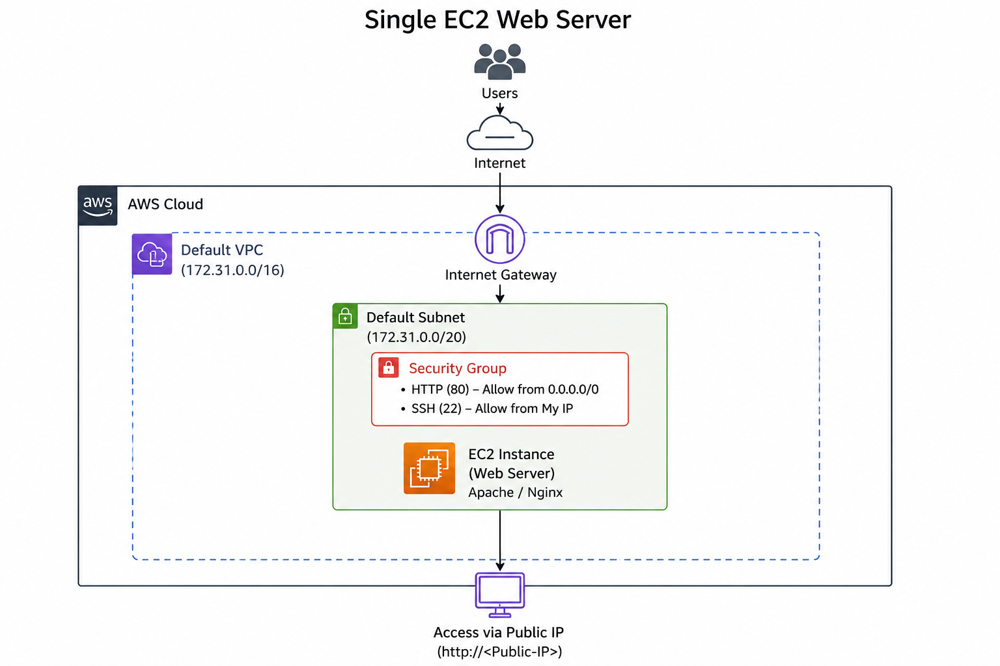
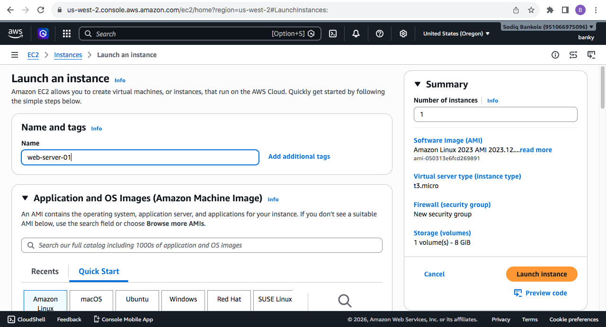
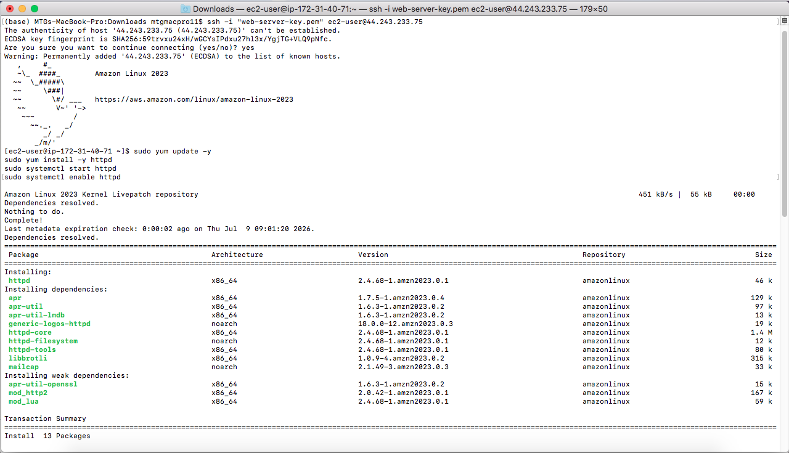
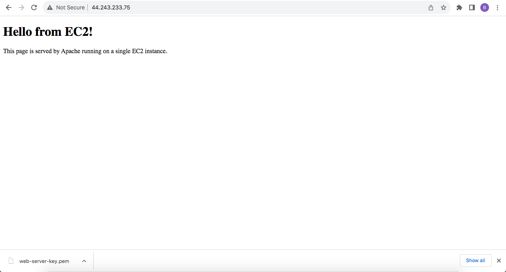

# aws-ec2-single-web-server
Single-server web hosting on AWS EC2 using Apache and the default VPC

# Overview

This project is the first in a hands-on AWS series aimed at building practical cloud engineering skills. The goal was simple: understand how a web application runs on a single server by launching an EC2 instance, installing a web server, and serving a static HTML page over the public internet.

No load balancers, no auto-scaling, no managed services — just one server doing all the work. This is the foundation every other AWS architecture builds on top of.

# What I Built

A single EC2 instance running Apache HTTP Server (httpd), serving a static HTML page accessible via the instance's public IP address, using AWS's default VPC networking.

# AWS Services Used

- Amazon EC2
- Amazon VPC (Default VPC)
- Security Groups
- Internet Gateway

## Architecture Diagram

Steps Taken

# Launched the EC2 Instance
AMI: Amazon Linux 2023 (free tier)
Instance type: t2.micro
Used the account's default VPC and its pre-configured public subnet — no custom VPC needed, since the default VPC already comes with an Internet Gateway, route table, and auto-assigned public IPs
Created a new key pair for SSH access
Configured the Security Group to allow:
SSH (port 22) from my IP
HTTP (port 80) from anywhere

# Connected via SSH
bash
chmod 400 web-server-key.pem
ssh -i "web-server-key.pem" ec2-user@<PUBLIC_IP>

# Installed Apache

bash
sudo yum update -y
sudo yum install -y httpd
sudo systemctl start httpd
sudo systemctl enable httpd

enable ensures Apache restarts automatically if the instance reboots.

# Deployed a Static HTML Page

Created /var/www/html/index.html with a simple page confirming the server was live and serving content.

# Verified Access

Visited http://44.243.233.75 in a browser and confirmed the page loaded successfully.

# Networking Notes

This project relied on the AWS default VPC, which comes pre-configured with:

Component	Purpose
VPC	Isolated network (e.g. 172.31.0.0/16)
Public Subnet	One per Availability Zone, auto-assigns public IPs
Internet Gateway	Attached by default, allows internet traffic in/out
Route Table	Routes 0.0.0.0/0 traffic to the Internet Gateway
Security Group	Instance-level firewall — this is the one component I had to configure manually

Understanding this chain (Internet → IGW → Route Table → Subnet → Security Group → Instance) was the key networking takeaway from this project — it's also the standard troubleshooting path when an EC2-hosted site isn't reachable.

# What I Learned
How to launch and configure an EC2 instance from scratch
How Security Groups control inbound/outbound traffic at the instance level
How the default VPC's networking components (subnet, IGW, route table) work together to make an instance internet-accessible
How to install and manage a web server (Apache) on Amazon Linux
The full request path traffic takes from a browser to an EC2 instance

# Notes
The public IP used for this project is not static. It will change if the instance is stopped/restarted, unless an Elastic IP is attached. This project used a standard public IP for learning purposes.
Instance was stopped/terminated after project completion to avoid unnecessary cost.
